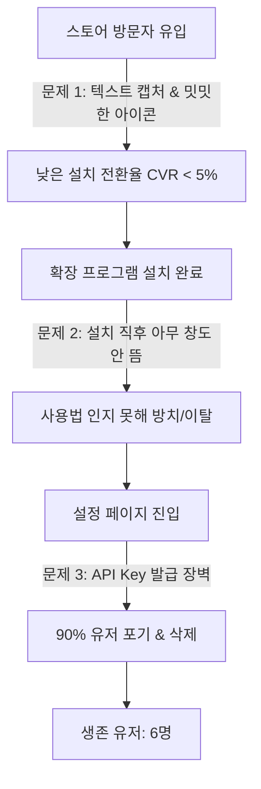
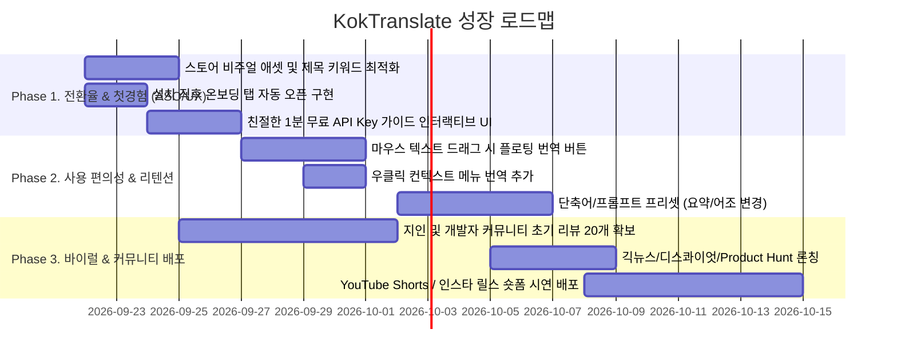

# 🚀 KokTranslate 사용자 1만 명 달성을 위한 종합 성장 & 전환율(CRO/ASO) 전략 보고서

> **분석 대상:** [KokTranslate 크롬 웹스토어 등록 페이지](https://chromewebstore.google.com/detail/koktranslate/cnbkokanimgdjipjhbjgkgmpkkneiemh)  
> **작성 일자:** 2026-09-21 | **현재 버전:** v1.8 | **현재 활성 유저:** **6명** (리뷰 0개)

---

## 1. 🔍 브라우저 실태 조사 및 핵심 현황 진단

크롬 웹스토어 내부 데이터(Internal Payload)와 실제 확장 프로그램 코드를 브라우저 에이전트로 정밀 분석한 결과, **KokTranslate의 제품 본질(LLM 기반 마우스 포인팅 & 드래그 즉시 번역)은 매우 혁신적이고 훌륭하지만, 스토어 첫인상과 온보딩 과정에서 99%의 유저가 이탈하는 치명적인 병목**을 겪고 있습니다.

### 📊 현재 스토어 지표 분석
| 지표 항목 | 현재 수치 | 상태 진단 |
| :--- | :--- | :--- |
| **주간 활성 사용자** | **6명** | 극초기 단계, 노출 및 자연 유입 극히 저조 |
| **스토어 평점 / 리뷰** | **0.0 / 0개** | 사회적 증거(Social Proof) 부재로 인한 다운로드 망설임 |
| **지원 언어(i18n)** | 한국어, 영어 (2개국어) | 글로벌 잠재 수요(일본, 대만, 유럽 등) 흡수 한계 |
| **스토어 대표 이미지** | 단순 기능 캡처 3장 | 텍스트 중심 캡처로 시각적 매력도와 전달력 부족 |
| **추천 배너(Marquee)** | **미등록 (부재)** | 구글 크롬 스토어 "추천(Featured) 확장" 선정 불가 |

---

## 2. ⚠️ 유저 유입 및 정착을 가로막는 4대 핵심 병목 (Bottlenecks)



### 1) 스토어 그래픽의 낮은 소구력 (Low Store CVR)
- **아이콘 정체성 부재:** 현재 아이콘은 보라색 비정형 도형으로, 유저가 보았을 때 '번역기'인지, 'AI 툴'인지 직관적으로 인지하기 어렵습니다.
- **부정적 인상을 주는 스크린샷 2번:** 현재 스토어 2번째 스크린샷이 **텅 빈 흰 화면에 "Gemini API Key" 입력창 하나만 덜렁 있는 화면**입니다. 방문자는 이를 보고 *"이거 쓰려면 개발자 키 발급받아야 해? 귀찮다"*라고 느껴 즉시 창을 닫게 됩니다.
- **헤드라인 카피 부재:** 스크린샷에 어떠한 혜택(Benefit) 강조 자막("1초 만에 콕!", "단축키로 탭 이동 없는 번역")도 없습니다.

### 2) 설치 직후 "첫 경험(Aha-Moment)" 온보딩 부재
- `background.js`에 `chrome.runtime.onInstalled` 이벤트가 없습니다.
- 유저가 [Chrome에 추가]를 눌러도 아무런 웰컴 페이지나 튜토리얼 탭이 열리지 않아 **"설치는 됐는데 어떻게 쓰는 거지?"** 상태로 머무릅니다.

### 3) Gemini API Key 발급의 높은 심리적 장벽
- 개발자에게는 AI Studio에서 키를 복사하는 것이 쉽지만, 일반 대학생/직장인/연구원 유저에게는 **"Google Cloud / AI Studio 가입 및 키 생성"**이 매우 낯설고 두려운 작업입니다.

### 4) 트리거(실행) 접근성 한계
- 현재 실행 방식이 `Ctrl+Shift+X` 단축키 또는 툴바 아이콘 클릭 후 버튼 누르기뿐입니다.
- 일상적인 번역 확장의 핵심인 **"텍스트 드래그 시 마우스 옆에 뜨는 미니 번역 아이콘"** 또는 **"마우스 우클릭(컨텍스트 메뉴) 번역"**이 없어 일상 브라우징에서 자연스럽게 상기되지 않습니다.

---

## 3. 🎨 시각적 애셋(그림) 전면 리뉴얼 제안

유저가 스토어에 들어왔을 때 3초 안에 신뢰를 느끼고 [Chrome에 추가]를 누르도록 고품질 비주얼 시안을 생성했습니다.

### ① 스토어 추천 피처드(Featured) 배너 & 마키 (1400x560 / 16:9)
> 웹스토어 메인 추천 배너 및 스토어 상세 헤더에 활용하여 압도적인 첫인상을 부여합니다.


- **핵심 포인트:**
  - 현대적인 다크 모드 & 네온 퍼플/사이언 하이라이트
  - 손가락 포인터가 단어를 '콕!' 집는 모션과 글래스모피즘 번역 툴팁 시각화
  - "Google Gemini AI 탑재", "Instantly Translate Text in Any Tab" 직관적 영문 슬로건 배치

### ② 앱 아이콘 리뉴얼 시안 (1:1 / 512x512, 128x128, 48x48, 16x16)
> 기존의 모호한 보라색 블롭을 대체하는 프리미엄 3D 벡터 심볼 디자인입니다.


- **핵심 포인트:**
  - **클릭 포인터 + 다국어 번역 기호(A/文) + Gemini AI 스파클**의 3중 결합
  - 브라우저 상단 툴바(16px, 32px)에서도 선명하게 식별되는 뚜렷한 대비감

### ③ 스토어 스크린샷 5장 구성 스토리보드 권장안
단순 화면 캡처가 아닌, **디바이스 프레임 + 상단 헤드라인 카피 바**가 결합된 카드 뉴스 형태여야 합니다:

1. **Slide 1 (대표):** `[콕! 찍으면 1초 만에 AI 번역]` - 마우스 클릭 즉시 인라인 툴팁으로 번역문이 뜨는 역동적인 화면
2. **Slide 2 (선택 번역):** `[마우스 드래그 & 자동 스크롤]` - 긴 기술 문서나 표(Table)를 드래그하여 번역하는 모습
3. **Slide 3 (대조 뷰어):** `[원문 ↔ 번역 실시간 대조]` - 툴팁 상단 토글로 원문과 번역문을 번갈아 비교하는 학습/연구 최적화 뷰
4. **Slide 4 (서식 보존):** `[표, 코드, 볼드체 서식 100% 유지]` - 깨짐 없는 마크다운 렌더링 강조
5. **Slide 5 (무료 & 보안):** `[Google 공식 Gemini 무료 API 연동]` - 내 브라우저에만 안전하게 저장되는 제로 서버 프라이버시

---

## 4. 📈 많은 유저를 확보하기 위한 5대 실행 액션 플랜



### Action 1. 스토어 타이틀 및 검색 키워드(ASO) 최적화
크롬 웹스토어 검색 엔진은 **확장 프로그램 이름(Title)**에 가장 높은 가중치를 둡니다.

- **현재 한국어 이름:** `KokTranslate`  
  👉 **개선안:** `콕! 번역기 - Gemini AI 마우스 클릭 & 드래그 즉시 번역 (KokTranslate)`
- **현재 영문 이름:** `KokTranslate`  
  👉 **개선안:** `KokTranslate - Gemini AI Point & Click Instant Web Translator`
- **핵심 검색 유입 키워드 확보:** `AI 번역`, `제미나이 번역`, `드래그 번역`, `웹페이지 번역`, `Gemini Translator`, `Click to translate`

### Action 2. 설치 즉시 온보딩(Welcome Guide) 자동 오픈
유저가 확장 프로그램을 설치하는 즉시 브라우저 새 탭으로 가이드 페이지를 띄워 첫 사용법을 10초 만에 체득하게 해야 합니다.

```javascript
// background.js 에 추가할 코드
chrome.runtime.onInstalled.addListener((details) => {
  if (details.reason === "install") {
    // 설치 즉시 웰컴 & API 키 세팅 가이드 탭 오픈
    chrome.tabs.create({ url: "guide.html#welcome" });
  }
});
```

### Action 3. "1분 무료 API 키 세팅" 경험의 극적 개선
- 설정 창에 구글 AI Studio로 바로 가는 `[Google 로그인하고 무료 키 발급받기 →]` 원클릭 버튼 배치.
- 캡처 GIF 또는 3단계 이미지로 "어디를 클릭해서 키를 복사하면 되는지" 시각적으로 가이드.
- 기본 탑재 테스트: 처음 설치 시 "1회 무료 체험 번역(데모 모드)"을 제공하거나 친절한 인라인 검증 UI 제공.

### Action 4. 일상적 트리거(Trigger) 확장: 2가지 필수 기능
1. **텍스트 드래그 플로팅 아이콘 (선택 옵션):**
   - 웹페이지에서 단어나 문장을 블록 지정하면 마우스 우측 상단에 작은 보라색 콕! 아이콘이 떠서 클릭 한 번으로 번역.
2. **우클릭 컨텍스트 메뉴 (Context Menus):**
   - 블록 지정 후 우클릭 -> `[KokTranslate로 번역]` 메뉴 추가 (`manifest.json`에 `contextMenus` 권한 추가).

### Action 5. 초기 리뷰(Social Proof) 20개 확보 & 커뮤니티 시딩
크롬 웹스토어에서 평점 5.0과 리뷰 10개 이상이 쌓이면 알고리즘이 "추천 확장" 및 관련 검색어 상위 노출을 시작합니다.
- **번역 완료 툴팁 하단에 작은 만족도 피드백 버튼 추가:**  
  "도움이 되셨나요? 스토어에 별점 남겨주시면 큰 힘이 됩니다 ⭐"
- **타깃 커뮤니티 배포:**
  - **GeekNews (긱뉴스):** "구글 Gemini 무료 API로 웹페이지 요소를 마우스로 콕 찍어 번역하는 크롬 확장을 만들었습니다"
  - **디스콰이엇 (Disquiet):** 프로덕트 론칭 등록
  - **클리앙, 루리웹, 뽐뿌 개발자/IT 게시판:** 영어 논문/공식 문서 읽을 때 편한 무료 툴로 소개
  - **글로벌:** Reddit (`r/chrome_extensions`, `r/GoogleGeminiAI`), Product Hunt

---

## 5. 💡 다음 실행 제안

1. **신규 아이콘 및 프로모션 배너 애셋 등록** (`manifest.json` 및 웹스토어 개발자 대시보드)
2. **온보딩 탭 자동 오픈(`chrome.runtime.onInstalled`) 코드 적용**
3. **스토어 제목/설명문 ASO 텍스트 업데이트**

원하시는 항목을 말씀해 주시면, 바로 코드 수정 및 스토어 등록 준비 작업을 도와드리겠습니다!
